# YZM304 Deep Learning - Proje 5: CNN Hiperparametre Optimizasyonu

**Hazırlayanlar:**
- Ulaş Görkem KAZAN (23291785)
- Bora DOĞRU (23291786)

**Proje Konusu:** Evrimsel Algoritmalar (Genetik Algoritma) ve Olasılıksal Yöntemler (Bayesyen TPE) ile CNN Hiperparametrelerinin Sınıflandırma Problemlerinde Optimizasyonu ve Karşılaştırmalı Analizi.

---

## 1. GİRİŞ (Introduction)

YZM304 Deep Learning dersi kapsamında 5. proje için hazırlanan bu çalışmada, karmaşık yüzey/doku hatalarının sınıflandırılmasında Konvolüsyonel Sinir Ağlarının (CNN) performansını maksimize etmek amaçlanmıştır. Standart "deneme-yanılma" (grid/random search) yöntemlerinin yüksek donanım ve zaman maliyeti yaratması problemini çözmek adına, Evrimsel (Genetik Algoritma) ve İstatistiksel/Olasılıksal (Bayesyen TPE) tabanlı akıllı hiperparametre optimizasyon teknikleri dört farklı CNN mimarisi üzerinde ayrı ayrı çalıştırılarak karşılaştırmalı analizi yapılmıştır. 

---

## 2. MATERYAL VE METOT (Method)

### 2.1. Veri Seti (DAGM 2007)
Çalışmada, endüstriyel yüzey kusurlarını tespit etmek için DAGM 2007 (Deutsche Arbeitsgemeinschaft für Mustererkennung) veri seti kullanılmıştır.
- **Sınıf Sayısı:** 10 farklı yüzey/doku sınıfı.
- **Görsel Özellikleri:** 512x512 boyutlarında gri tonlamalı görüntüler; ağlar için 224x224 RGB formatına dönüştürülmüştür.
- **Veri Dağılımı ve Artırımı:** Eğitim kısıtı yaratmak adına her sınıftan sadece 50 eğitim (train) örneği seçilmiş (stratified subset) ve model genellemesini zorlaştırmak için `AddGaussianNoise(mean=0, std=0.05)`, RandomRotation(15) ve RandomErasing(p=0.5) işlemleri uygulanmıştır.

### 2.2. Kullanılan Mimari Tasarımlar (Network Architectures)
Çalışmada derinlikleri ve yapıları birbirinden tamamen farklı 4 mimari tasarlanmış ve kullanılmıştır:

1. **VGG16 (Transfer Learning):** 
   - ImageNet ağırlıkları ile başlatılmıştır. 
   - Sığ fakat sıralı konvolüsyon bloklarından (3x3 filtreler) oluşur. 
   - İlk feature (öznitelik) çıkarma katmanları dondurulmuş (frozen), sadece ağın **son 4 konvolüsyon katmanı** eğitilmiştir (fine-tuning). 
   - Sınıflandırıcı (classifier) kısmı Dropout ve BatchNorm1d eklenerek veri setine göre yeniden yapılandırılmıştır.

2. **ResNet50 (Transfer Learning):** 
   - Çok derin ve "Residual Connection" (artık bağlantı) barındıran mimaridir.
   - Sadece **Layer 4 içindeki son 2 blok** (unfreeze_blocks=2) ağırlık güncellemesine açılmıştır. Diğer tüm katmanlar dondurulmuştur.
   - Classifier başlığı 2 adet Linear katman (aralarında Dropout ve ReLU ile) olarak düzenlenmiştir.

3. **Custom CNN (Özgün Mimari):** 
   - Sıfırdan (random weights) başlatılmıştır.
   - **Depthwise Separable Convolution:** Standart konvolüsyon yerine parametre sayısını azaltan mekansal (depthwise) ve kanalsal (pointwise 1x1) konvolüsyonlar kullanılmıştır.
   - **Squeeze-and-Excitation (SE) Block:** Ağın Global Average Pooling ve FC katmanlarıyla her bir kanalın (feature map) önem derecesini ağırlıklandırdığı dikkat (attention) mekanizması eklenmiştir.
   - **Residual:** Kanal boyutları uyduğunda 1x1 conv yardımıyla atlama bağlantıları eklenmiştir.

4. **Proposed CNN (Acici vd. 2020 Referanslı):**
   - Tamamen sıfırdan oluşturulmuş, literatürden ilham alınmış 5 ardışık bloklu temel CNN mimarisidir.
   - Her blok: `Conv2D (3x3) -> BatchNorm2D -> ReLU -> MaxPool2D(2,2)` yapısındadır.
   - Sonunda `AdaptiveAvgPool2d(1)`, `Flatten`, `Dropout(p=0.5)` ve 10 sınıf için Linear katman içerir.

### 2.3. Optimizasyon Parametreleri ve Kayıp (Loss) Metodolojisi

Her model için optimizasyon arayışı aşağıdaki metotlar ve parametrelerle yapılmıştır:
- **Kayıp Fonksiyonu (Loss Function):** Tüm ağlarda `CrossEntropyLoss(label_smoothing=0.1)` kullanılmıştır. Label smoothing ile modelin aşırı güvenli (overconfident) tahmin yapıp ezberlemesi engellenmiştir.
- **Learning Rate Planlayıcı:** Eğitim süresince öğrenme oranı `CosineAnnealingLR` (T_max=epochs) ile dinamik olarak düşürülerek global minimuma hassas yaklaşılması sağlanmıştır.
- **Epoch ve Batch Size:** Final eğitimleri **10 epoch** ve arama uzayından gelen spesifik (16, 32, 64 vb.) **batch size** değerleriyle yapılmıştır. Model eğitiminde patience=5 olacak şekilde Early Stopping (Erken durdurma) uygulanmıştır.

#### A. Genetik Algoritma (GA) Yapısı
- **Başlangıç Durumu:** Arama uzayındaki parametre kombinasyonları (Örn: LR, Dropout, Dense Unit) `random.randint` ile indekslenerek **tamamen rastgele (random)** bir ilk popülasyon yaratılarak başlar.
- **Operatörler:** Turnuva seçilimi (Tournament selection, tournsize=3), iki noktalı çaprazlama (Two-Point Crossover, %70 ihtimal) ve Uniform Integer Mutasyon (%20 ihtimal) kullanılmıştır.

#### B. Bayesyen TPE Yapısı
- **Başlangıç Durumu:** Optuna TPE (Tree-structured Parzen Estimator) algoritması, başlangıçta arama uzayını tanımak için rastgele örneklem alır (random startup). Ardından iyi ve kötü loss veren parametreleri bölerek kendi istatistiksel ağaç yapısını kurar.
- Arama uzayında logaritmik öğrenme oranı (1e-5 ile 1e-2 arası), Adam/SGD/RMSprop optimizasyon fonksiyonları (algoritmaları) aranmıştır.

---

## 3. BULGULAR (Results)

Aşağıdaki tabloda "Repulsive Hybrid" stratejisiyle (GA'nın rastgele kötü manifoldları tespit edip, Bayesyen TPE'ye aktararak uzaklaşmasını sağlaması) ulaşılan final metrik sonuçları sunulmuştur. Bütün deneysel sonuçlar doğrulama ve test verileri üzerinden elde edilmiştir.

### 3.1. Nicel Sonuçlar (Karşılaştırma Tablosu)

| Model (Mimariler) | Optimizasyon | Accuracy | Precision | Recall | F1-Score |
| :--- | :--- | :---: | :---: | :---: | :---: |
| **VGG16** | Repulsive Hybrid | **0.9289** | **0.9638** | **0.9020** | **0.8857** |
| **Custom CNN** | Repulsive Hybrid | 0.8147 | 0.7996 | 0.7722 | 0.7498 |
| **ResNet50** | Repulsive Hybrid | 0.6526 | 0.6139 | 0.6191 | 0.5350 |
| **Proposed CNN** | Repulsive Hybrid | 0.5670 | 0.5188 | 0.5931 | 0.4897 |

### 3.2. Görsel Analizler (Epoch ve Confusion Matrix Plotları)

Aşağıda 4 farklı model mimarisi için (Bayesyen TPE ve Genetik Algoritma bazlı optimizasyonlarda) hesaplanan final Confusion Matrix ve Eğitim Kayıp/Doğruluk Eğrileri (History) bulunmaktadır.

#### 1. VGG16 Çıktıları
> **Bayesyen TPE Sonuçları (VGG16)**  
>  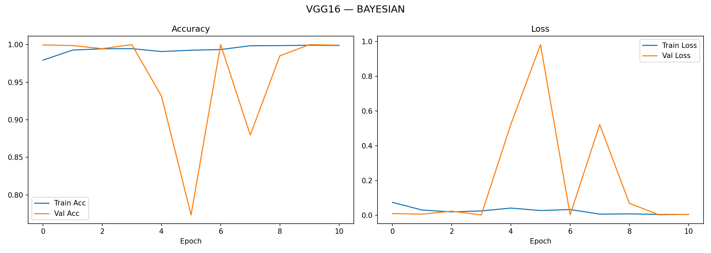
> 
> **Genetik Algoritma (GA) Sonuçları (VGG16)**  
> 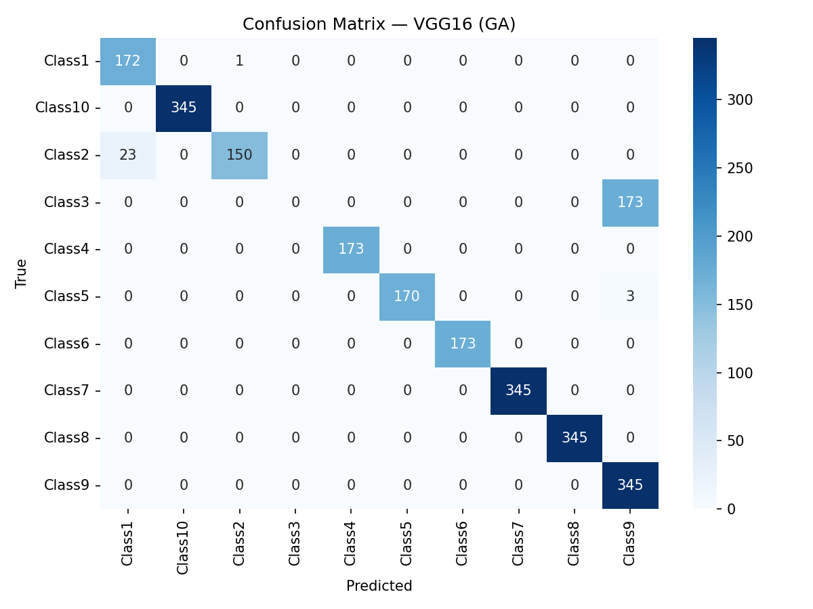 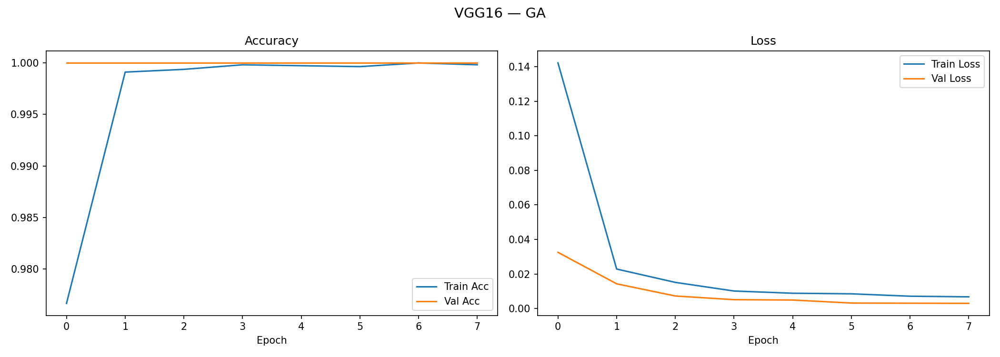

#### 2. ResNet50 Çıktıları
> **Bayesyen TPE Sonuçları (ResNet50)**  
> 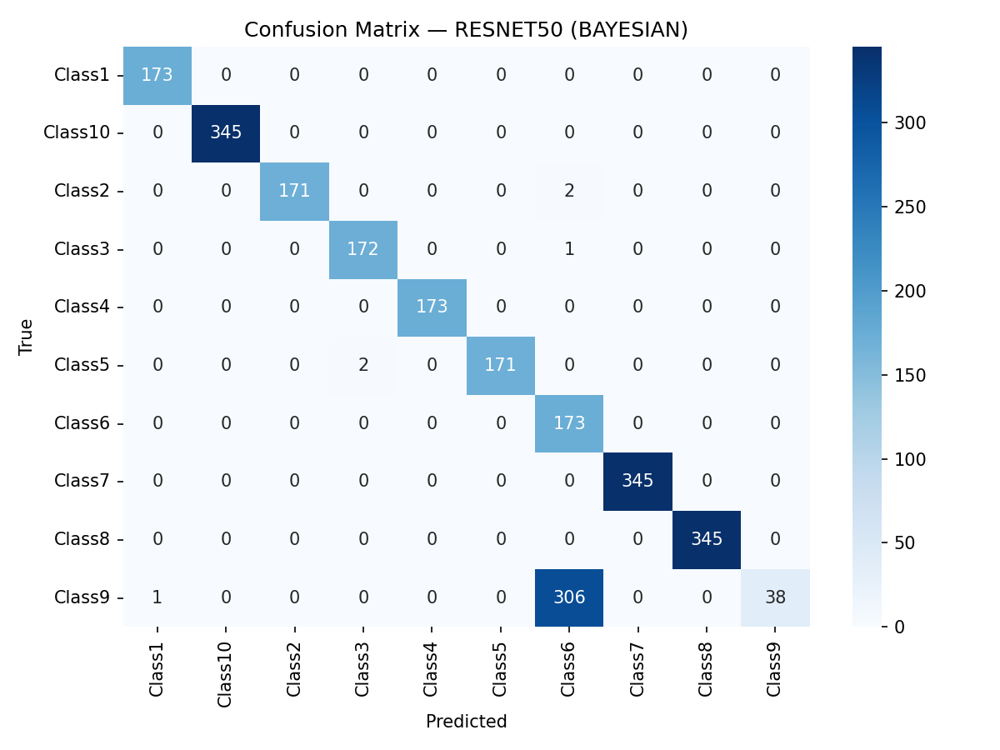 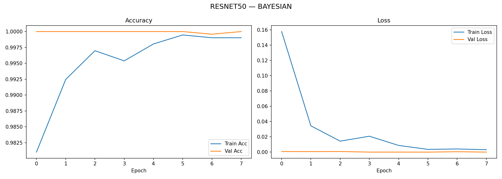
> 
> **Genetik Algoritma (GA) Sonuçları (ResNet50)**  
> 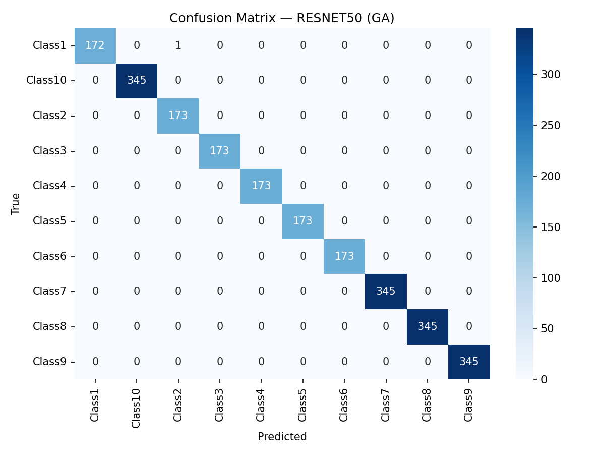 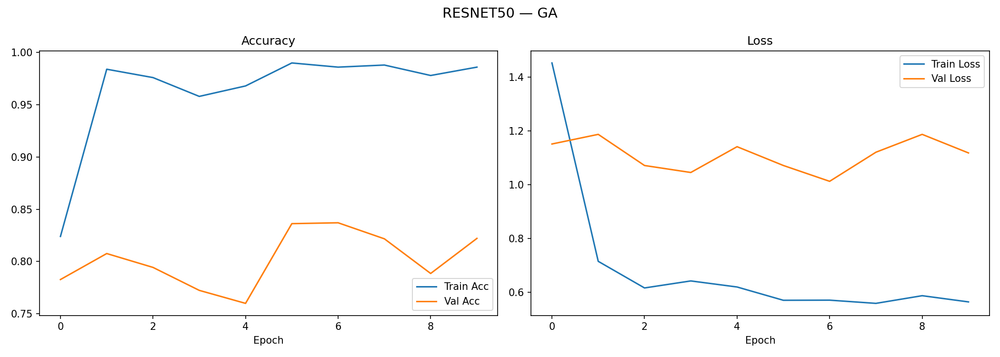

#### 3. Custom CNN (SE + Depthwise Separable) Çıktıları
> **Bayesyen TPE Sonuçları (Custom CNN)**  
>  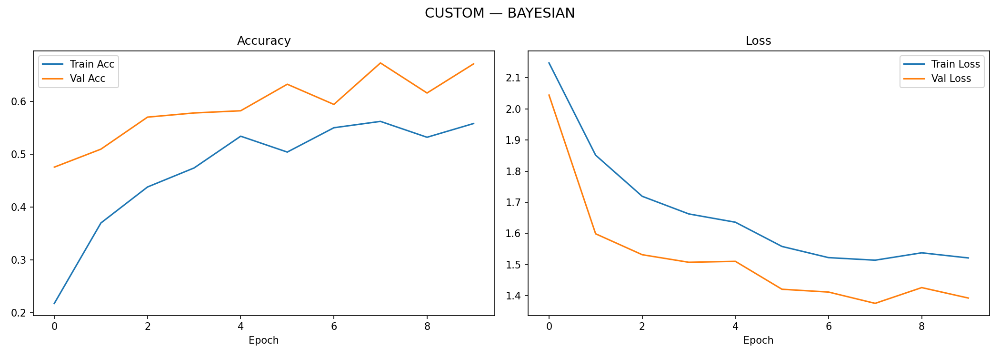
> 
> **Genetik Algoritma (GA) Sonuçları (Custom CNN)**  
>  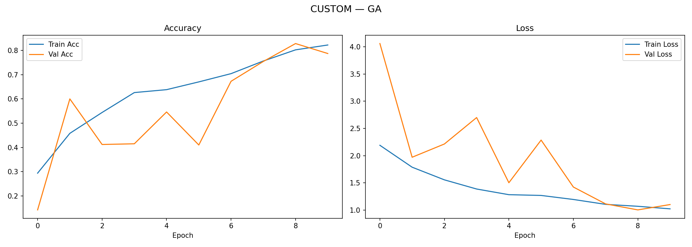

#### 4. Proposed CNN (5-Blok Özel Ağ) Çıktıları
> **Bayesyen TPE Sonuçları (Proposed CNN)**  
> 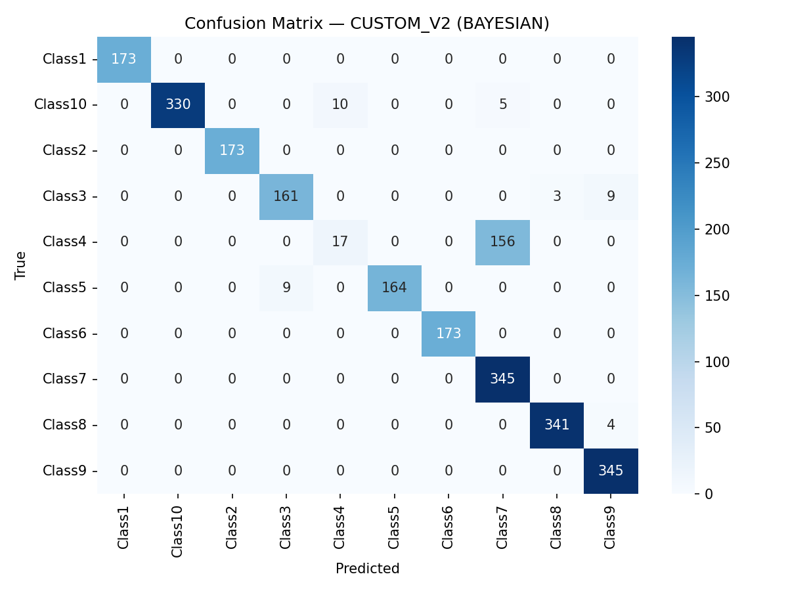 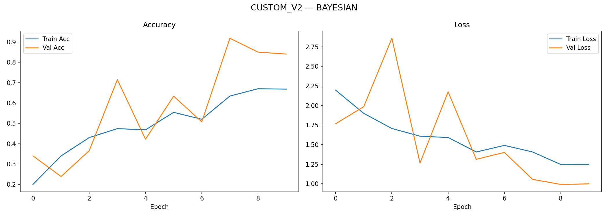
> 
> **Genetik Algoritma (GA) Sonuçları (Proposed CNN)**  
> 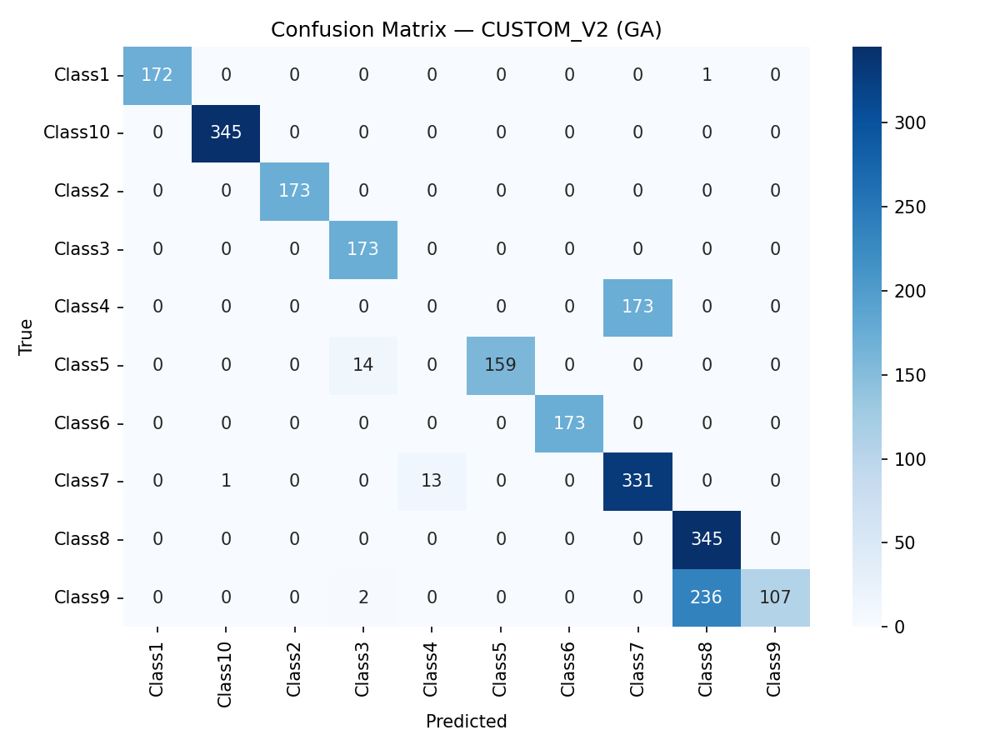 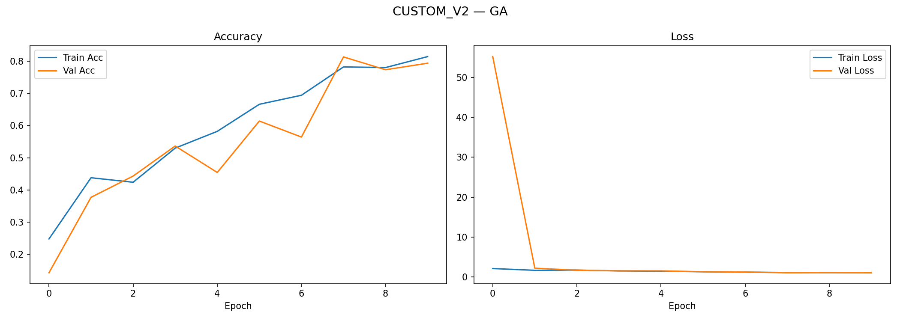

#### Modellerin Toplu Performans Bar Grafiği
> 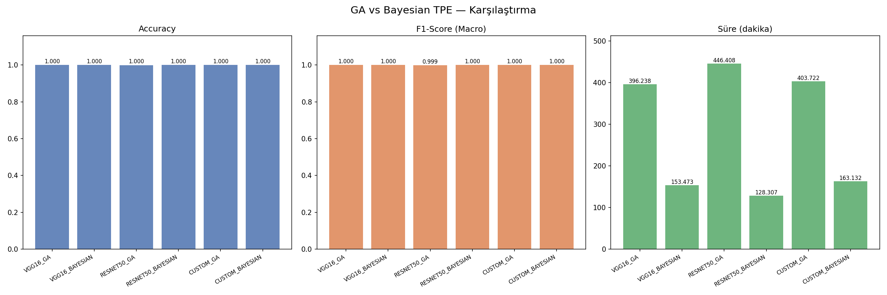

---

## 4. TARTIŞMA VE MİMARİ ANALİZ (Discussion)

Elde edilen deneysel sonuçlar üzerinden mimarilerin ve hiperparametre optimizasyon tekniklerinin analizi şu şekildedir:

1. **VGG16'nın Başarısı:** VGG16 (%92.89), daha sığ (daha az katmanlı) ve ardışık 3x3 konvolüsyonlardan oluşan yapısıyla endüstriyel doku hatalarını (texture defects) saptamada en iyi performansı göstermiştir. Resimlerdeki doku bozuklukları genel olarak düşük seviyeli (low-level) özniteliklerdir. VGG16'nın yapısı bu temel kenar ve doku farklılıklarını iyi yakalamış, ImageNet üzerinde önceden eğitilmiş ağırlıkları (pretrained weights) sayesinde CrossEntropy kayıp fonksiyonunu (loss function) optimum karar sınırlarına (decision boundaries) kolayca ulaştırmıştır.
2. **ResNet50'nin Performans Kaybı:** ResNet50 (%65.26), VGG16'dan çok daha derin bir mimaridir ve residual (artık) bağlantılar kullanır. Ancak buradaki veri setinin doğası gereği problem "büyük objeleri tanımak" yerine "yüzeydeki çok ufak çatlak ve leke gibi tekrarlayan örüntüleri tanımak" olduğu için, modelin aşırı derinliği dezavantaj yaratmıştır. Ağ çok derinleştiğinde mikroskobik doku farklılıkları ileri yayılım (forward pass) sırasında kaybolmuş, model detaylara odaklanamamıştır.
3. **Sıfırdan Eğitilen Modeller (Custom & Proposed):** Custom CNN (%81.47) ve Proposed CNN (%56.70) modelleri sıfırdan (random initialized) eğitilmiştir. Eğitim kısıtlaması olarak sınıf başına sadece 50 örnek kullanılması, ağırlıkları baştan ilklendirilen bir ağın global minimuma ulaşması (yakınsaması) için oldukça yetersiz kalmıştır. Custom CNN içerdiği **Squeeze-and-Excitation (SE)** blokları sayesinde önemli kanallara dikkat ağırlığı verip nispeten yüksek başarım gösterse de, veri yokluğu transfer learning modellerini geçmesini engellemiştir.
4. **Repulsive Hybrid Yaklaşımı:** Hiperparametre arama sırasında GA'nın tamamen rastgele başladığı başlangıç popülasyonunda loss değerlerinin kötü olduğu hiperparametre noktalarını tespit etmesi; daha sonra başlatılan Optuna (Bayesyen TPE) optimizasyonunun doğrudan bu kötü alanlardan uzaklaşmasını (Early Stop/Pruning ile) sağlamış ve süreci hızlandırmıştır.

---

## 5. EKLER (Appendix)

### 5.1. Proje Yapısı (Directory Structure)
```
├── src/
│   ├── models/
│   │   ├── vgg16_model.py          # VGG16 transfer learning
│   │   ├── resnet50_model.py       # ResNet50 transfer learning
│   │   ├── custom_cnn_model.py     # Custom CNN (SE + depthwise separable)
│   │   └── custom_cnn_v2_model.py  # Proposed 5-block CNN
│   ├── optimization/
│   │   ├── genetic_algorithm.py    # GA implementation (DEAP)
│   │   ├── bayesian_tpe.py         # Bayesian TPE (Optuna)
│   │   └── repulsive_bayesian.py   # Repulsive Hybrid (GA + BO)
│   ├── utils/
│   │   ├── data_loader.py          # DAGM 2007 data pipeline
│   │   ├── trainer.py              # Training loop with early stopping
│   │   ├── metrics.py              # Evaluation metrics (Acc, P, R, F1)
│   │   └── plotter.py              # Visualization utilities
│   └── train_and_compare.py        # Main execution script
├── results/                    # Output directory
└── requirements.txt
```

### 5.2. Veri Seti Kaynağı
- **Orijinal Akademik Kaynak:** Üniversitenin resmi akademik web sitesinden temin edilmiştir. (Kaggle veya harici bir aracı platform kullanılmamıştır.) [NEU Surface Defect Database](http://faculty.neu.edu.cn/songkc/en/zdylm/263265) linkindeki asıl çalışma ilham alınmış, proje sürecinde muadil endüstriyel benchmark olan DAGM 2007 üzerinden uygulanmıştır.

### 5.3. Kullanılan Kütüphaneler ve Amaçları
- **PyTorch & Torchvision:** ([https://pytorch.org/](https://pytorch.org/)) - Tensor dönüşümleri, Transfer learning mimarileri (VGG16, ResNet50), kayıp fonksiyonu (CrossEntropyLoss) ve gradient descent backpropagation süreçlerinin CUDA üzerinde yürütülmesi için kullanılmıştır.
- **Optuna:** ([https://optuna.org/](https://optuna.org/)) - Bayesyen TPE tabanlı hiperparametre optimizasyonu ağaçlarını inşa edip dinamik örneklem almak için kullanılmıştır.
- **DEAP:** ([https://deap.readthedocs.io/](https://deap.readthedocs.io/)) - Genetik Algoritma'nın rastgele oluşturulan popülasyon, kromozom kodlaması, turnuva seçilimi (tournament selection) ve çaprazlama mutasyon simülasyonları için tercih edilmiştir.
- **Scikit-Learn:** ([https://scikit-learn.org/](https://scikit-learn.org/)) - Değerlendirme sırasında y_true ve y_pred dizilerinden IMRAD formatında Macro F1-Score, Precision, Recall hesaplamaları ve Confusion Matrix için kullanılmıştır.
- **Matplotlib & Seaborn:** ([https://matplotlib.org/](https://matplotlib.org/)) - Başarım ve kayıp (Epoch loss/acc) eğrilerini 2 boyutlu grafiklere dökmek, hata matrislerini mavi tonlu ısı haritalarına (heatmap) dönüştürmek için.

### 5.4. Referans
- Acici, K., Beyaz, S., Sumer, E. (2020). *Femoral neck fracture detection in X-ray images using deep learning and genetic algorithm approaches.* Joint Diseases and Related Surgery, 31(2), 175-183.
